# proyecto-solidaridadescuela

## Proyecto final de CVDS (Ciclos de Vida Del Desarrollo de Software). Periodo 2021-1

## Escuela Colombiana de Ingeniería Julio Garavito

### Integrantes 

- Oscar Nicolas Piñeros Campo (Equipo de Desarrollo)
- Kevin Edilson Garzon Piraban (Equipo de Desarrollo)
- Cristhian Camilo Castro Torres (Equipo de Desarrollo)
- Laura Daniela Pachon Cuan (Equipo de Desarrollo)

### Docente 

- Julian Mauricio Velasco Briceño (Dueño de Producto)

### Descripción del producto
#### Descripción general

El sistema permite a los estudiantes expresar sus necesidades de ciertos elementos para
poder realizar correctamente las actividades, y otros miembros de la comunidad pueden 
brindar estos elementos a quienes los necesiten. Asimismo, los miembros de la comunidad
pueden brindar diferentes elementos de interés a los estudiantes sin ningún requisito
específico. Además, el sistema cuenta con diferentes funciones de reporte y administración,
lo que le permite controlar el funcionamiento de la plataforma y el alcance de implementación.

### Manual de usuario
Primero al ingresar al siguiente [enlace](https://proyecto-solidaridadescuela.herokuapp.com/)

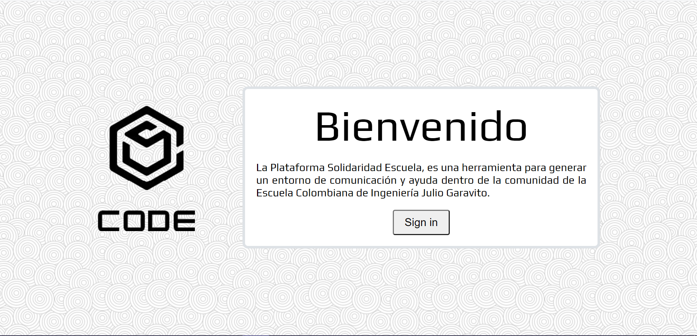

Al dar Click en el boton "Sing in" podremos iniciar sesión de forma correcta al ingresar
nos pedira diligenciar el Username y Password, se tiene la opción de recordar el usuario 
para ingresar nuevamente.

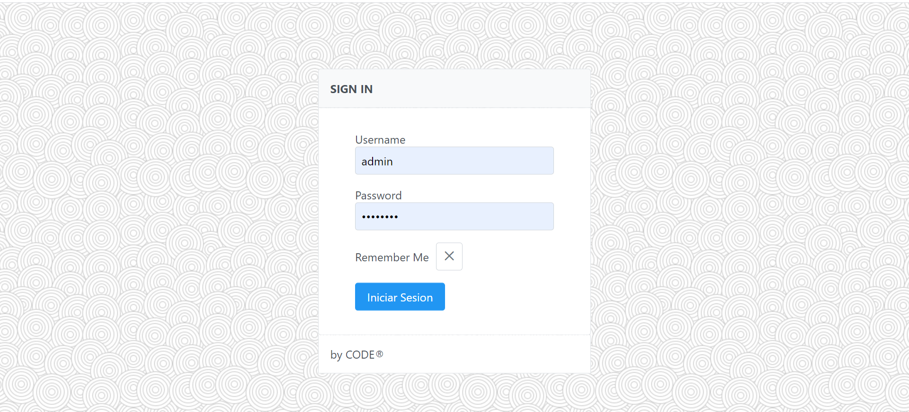

Al iniciar sesión se pude evidenciar en la parte posterior las diferentes herramientas que se 
tiene en la página,se evidencias las categorías, necesidades, ofertas, respuesta y el boton 
para salir de la página.

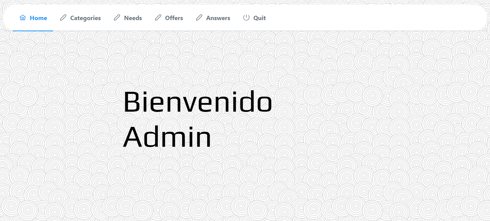

Acá se pueden crear, editar y eliminar las categorías

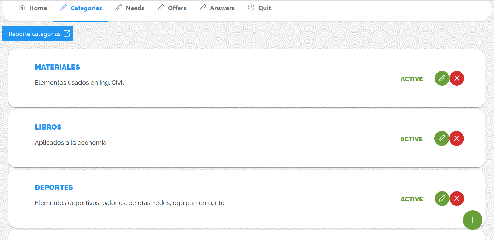

Se puede evidenciar las necesidades donde se puede editar y responder a estas

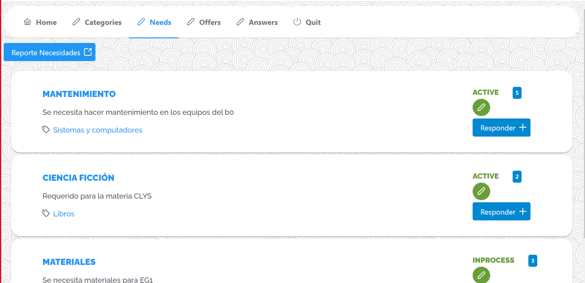

Se puede evidenciar las ofertas donde se puede editar y responder a estas

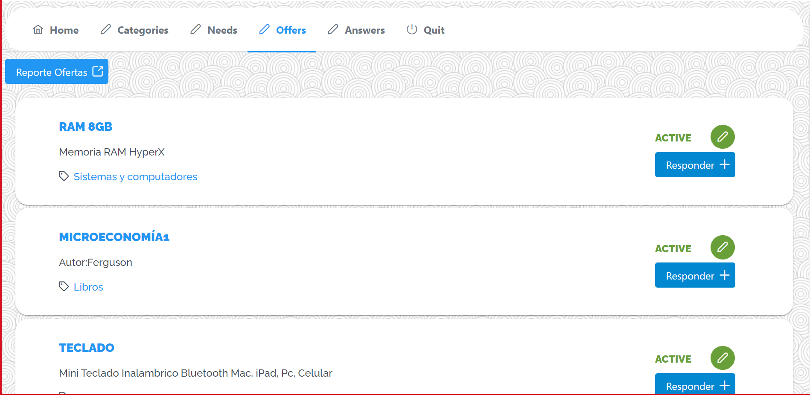

Se evidencias las respuetas donde se puede contestar a esta se puede observar la fecha y hora que se solicita
y si es de necesidad y oferta

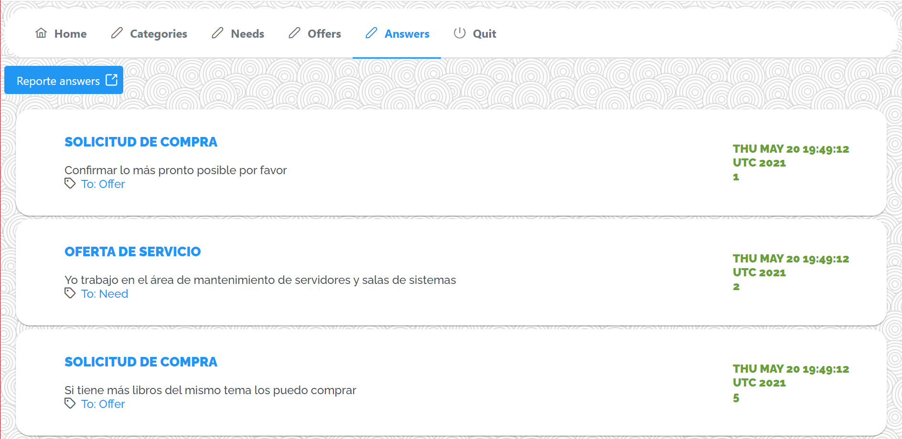

Para todas las anteriores el administrador puede obtener un reporte 
### credenciales para iniciar sesión:

* Como administrador:
    Username:admin 
    Password:admineci
    
* Como estudiante:
    Username:user
    Password:invitado
    
* Como profesor:
    Username:teach
    Password:teacher

* Como graduado:
    Username:gradu
    Password:graduate
    
* Como administrativos:
    Username:adminis
    Password:administrative
   
### Usuarios:
**username, password, rol**

1. admin, admineci, Administrator

2. user, invitado, Student

3. teach,teacher,Teacher

4. gradu,graduate,Graduate

5. adminis,administrative,Administrative

## Arquitectura y Diseño detallado:
### Modelo E-R.

### Diagrama de clases 

### Descripción de la arquitectura 

La aplicación esta formada por 3 capas:

#### Capa de Presentación 

En esta capa se hizo uso de las tecnologías como:

    * JSF(Java Server Faces) es un Framework
    * Primefaces(Biboloteca de componentes)

#### Capa de aplicación 

En esta capa se hizo uso de las tecnologías como:
    
    * Java
    * Google Guice (Framework de inyección de dependencias)
    * Apache Shiro (Framework para la autenticación)
    
### Capa de persistencia de datos

Para lograr una persistencia sobre los datos es necesario del motor de base de datos **PostgresSQL**
y la herramienta **myBatis** para mapear sentencias SQL

### Enlace a la aplicación en Heroku.

 

### Enlace al sistema de integración continua.

### Descripción sprint1
Burndown chart and backlog
•	Burndown chart: https://tree.taiga.io/project/nicolaspineros-solidaridad-escuela/taskboard/sprint-1-16929
Estos fueron los issues que nos hicieron falta por completar en el primer sprint, cada uno de los miembros del equipo trabajó de acuerdo con lo exigido, pero como era la primera vez que usábamos las aplicaciones como taiga, se nos dificultó hacerlo, y por eso no cumplimos con estos issues, aunque fueron cumplidos en el siguiente sprint.
•	Pendiente de revisión 
•	El estado debería ser creado por defecto en true
•	Mensaje de error al crear categoría con el mismo nombre 
•	Mensaje de error de categoría con el mismo nombre
•	Status no debería ser un campo de texto 
•	Las categorías no deberían ser visible el id sino el nombre
•	El estado debería ser active por defecto
•	El usuario no puede crear más de N necesidades
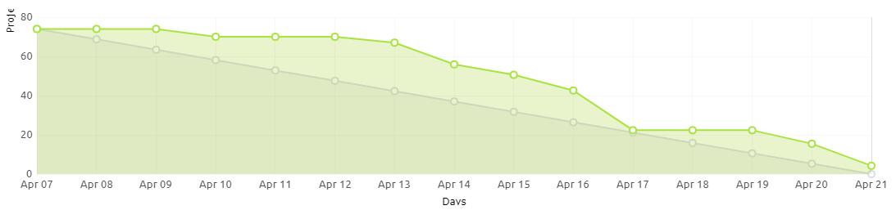

### Descripción sprint2
•	Burndown chart: https://tree.taiga.io/project/nicolaspineros-solidaridad-escuela/taskboard/sprint-2-9441
Estos fueron los issues que nos hicieron falta por completar en el primer sprint, cada uno de los miembros del equipo trabajó de acuerdo con lo exigido, y los pocos issues que se mencionaran fueron cumplidos en el siguiente sprint.
•	Mensaje de error explicito 
•	Mensaje de error explicito 
•	Estandarizar botones en necesidad y oferta
•	Validar estado de la necesidad/oferta al responder 
•	Validar usuarios al actualizar estado
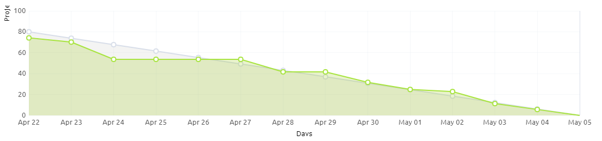

### Descripción sprint3
•	Burndown chart: https://tree.taiga.io/project/nicolaspineros-solidaridad-escuela/taskboard/sprint-3-6363
En este sprint se terminó todas las historias de usuario, como ya teníamos la práctica de los anteriores sprints, manejamos mucho mejor el tiempo, acercándonos cada vez más al trabajo realizado por día.
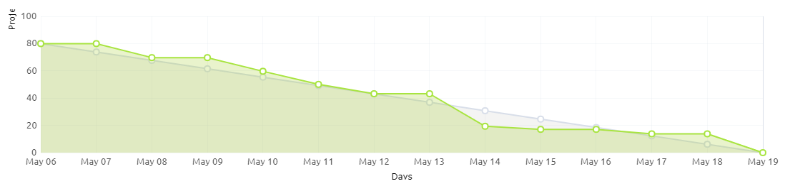
### Sprint-backlog
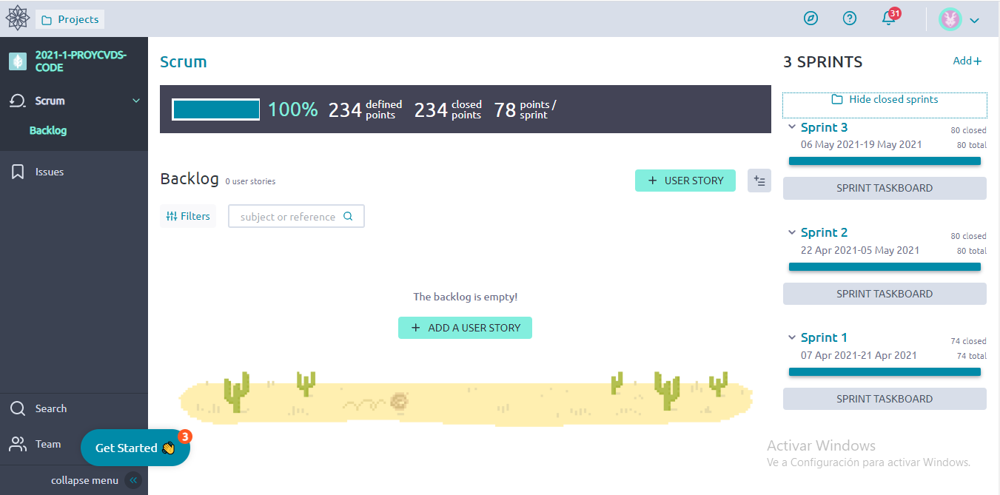
